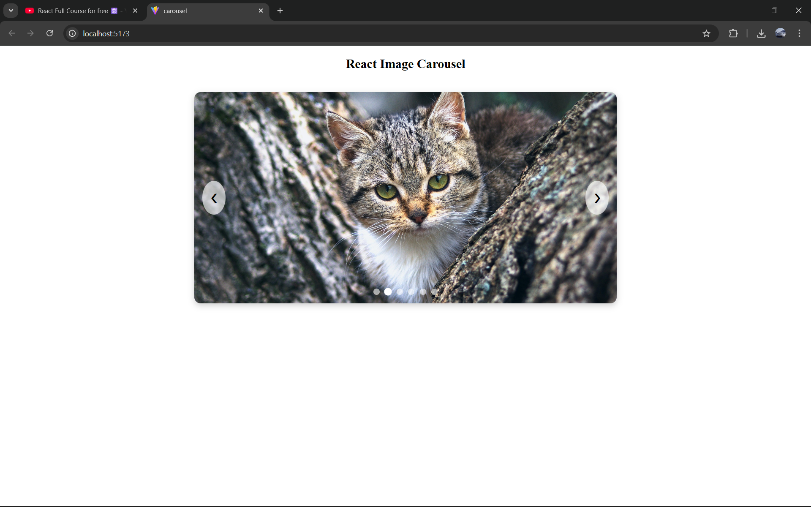
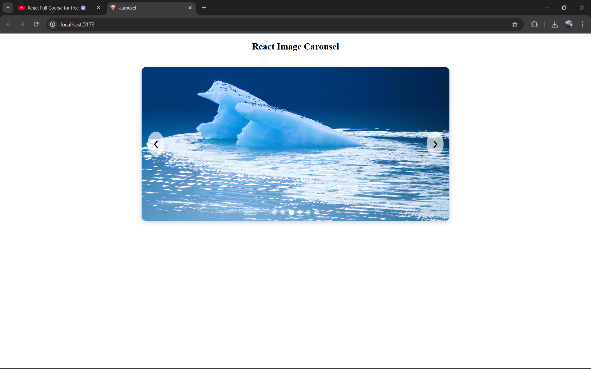
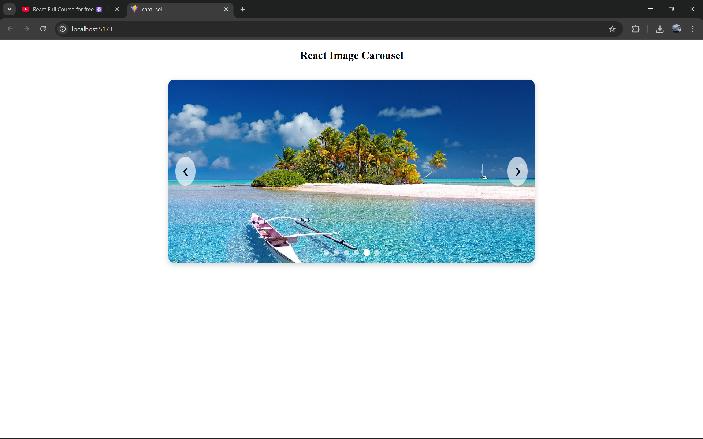

# Ex05 Image Carousel

## Date: 03-12-2025

## AIM
To create a Image Carousel using React 

## ALGORITHM

### STEP 1 Initial Setup:

Input: A list of images to display in the carousel.

Output: A component displaying the images with navigation controls (e.g., next/previous buttons).

### Step 2 State Management:

Use a state variable (currentIndex) to track the index of the current image displayed.

The carousel starts with the first image, so initialize currentIndex to 0.

### Step 3 Navigation Controls:

Next Image: When the "Next" button is clicked, increment currentIndex.

If currentIndex is at the end of the image list (last image), loop back to the first image using modulo:
currentIndex = (currentIndex + 1) % images.length;

Previous Image: When the "Previous" button is clicked, decrement currentIndex.

If currentIndex is at the beginning (first image), loop back to the last image:
currentIndex = (currentIndex - 1 + images.length) % images.length;

### Step 4 Displaying the Image:

The currentIndex determines which image is displayed.

Using the currentIndex, display the corresponding image from the images list.

### Step 5 Auto-Rotation:

Set an interval to automatically change the image after a set amount of time (e.g., 3 seconds).

Use setInterval to call the nextImage() function at regular intervals.

Clean up the interval when the component unmounts using clearInterval to prevent memory leaks.

## PROGRAM

### ImageCarousel.jsx
```jsx
import { useState, useEffect } from "react";
import "./carousel.css";
import img1 from "./assets/bird-3772889_1920.jpg";
import img2 from "./assets/cat-8361048_1920.jpg";
import img3 from "./assets/glacier-7187291_1920.jpg";
import img4 from "./assets/landscape.jpg";
import img5 from "./assets/polynesia-3021072_1920.jpg";
import img6 from "./assets/tree-7619791_1920.jpg";

const images = [img1, img2, img3, img4, img5, img6];

export default function ImageCarousel() {
  const [currentIndex, setCurrentIndex] = useState(0);

  // Next Image
  const nextImage = () => {
    setCurrentIndex((prevIndex) => (prevIndex + 1) % images.length);
  };

  // Previous Image
  const prevImage = () => {
    setCurrentIndex(
      (prevIndex) => (prevIndex - 1 + images.length) % images.length
    );
  };

  // Auto Slide
  useEffect(() => {
    const interval = setInterval(nextImage, 6000);
    return () => clearInterval(interval);
  }, []);

  return (
    <div className="carousel">
      <button className="btn prev" onClick={prevImage}>❮</button>
        
      

      <button className="btn next" onClick={nextImage}>❯</button>

      <div className="dots">
        {images.map((_, index) => (
          <span
            key={index}
            className={`dot ${index === currentIndex ? "active" : ""}`}
            onClick={() => setCurrentIndex(index)}
          ></span>
        ))}
      </div>
    </div>
  );
}
```

### carousel.css
```css
.carousel {
  position: relative;
  width: 800px;
  height: 400px;
  margin: 40px auto;
  overflow: hidden;
  border-radius: 12px;
  box-shadow: 0 4px 12px rgba(0,0,0,0.2);
}

.carousel-image {
  width: 100%;
  height: 100%;
  object-fit: cover;
  transition: opacity 0.4s ease-in-out;
}

.btn {
  position: absolute;
  top: 50%;
  transform: translateY(-50%);
  background: rgba(255,255,255,0.65);
  border: none;
  padding: 16px 16px;
  cursor: pointer;
  font-size: 24px;
  border-radius: 50%;
  transition: 0.3s;
}

.btn:hover {
  background: white;
}

.prev {
  left: 15px;
}

.next {
  right: 15px;
}

.dots {
  position: absolute;
  bottom: 12px;
  width: 100%;
  text-align: center;
}

.dot {
  height: 12px;
  width: 12px;
  margin: 0 5px;
  background-color: rgba(255,255,255,0.6);
  border-radius: 50%;
  display: inline-block;
  cursor: pointer;
  transition: 0.3s;
}

.dot.active {
  background-color: white;
  transform: scale(1.2);
}
```

### App.jsx
```jsx
import ImageCarousel from "./ImageCarousel"

function App() {
  return(
    <div>
      <h2 style={{ textAlign: "center", marginTop: "20px" }}>React Image Carousel</h2>
      <ImageCarousel />
    </div>
  );
}

export default App
```

## OUTPUT







## RESULT

The program for creating Image Carousel using React is executed successfully.
